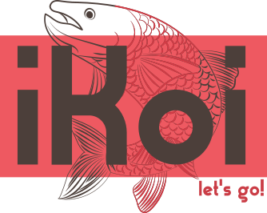
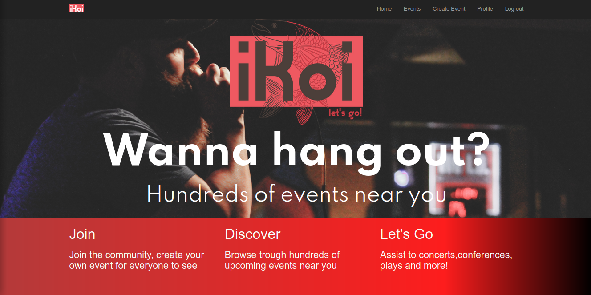
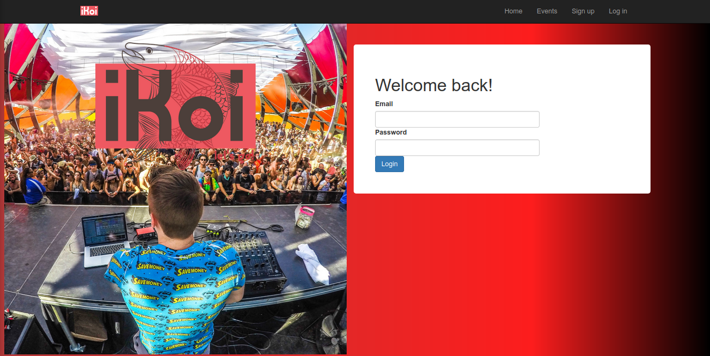
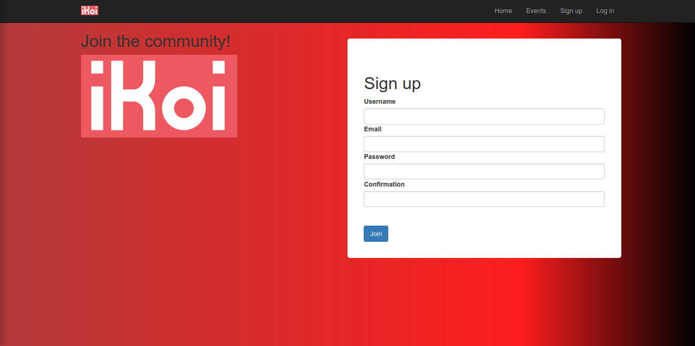
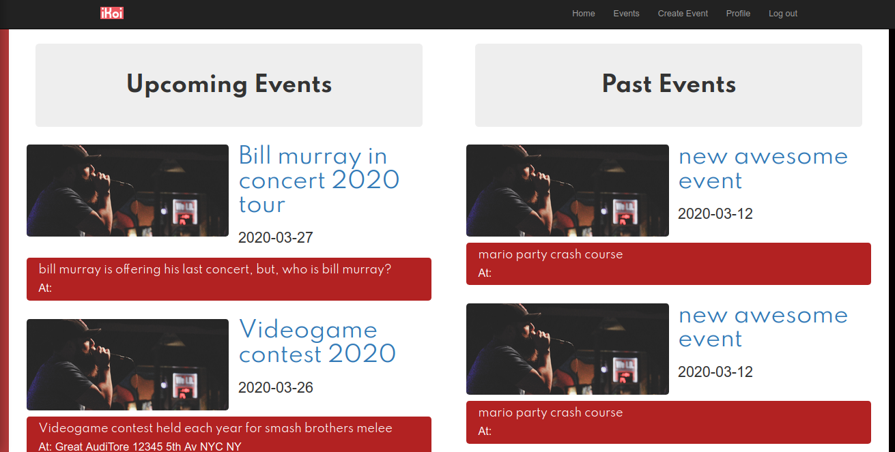
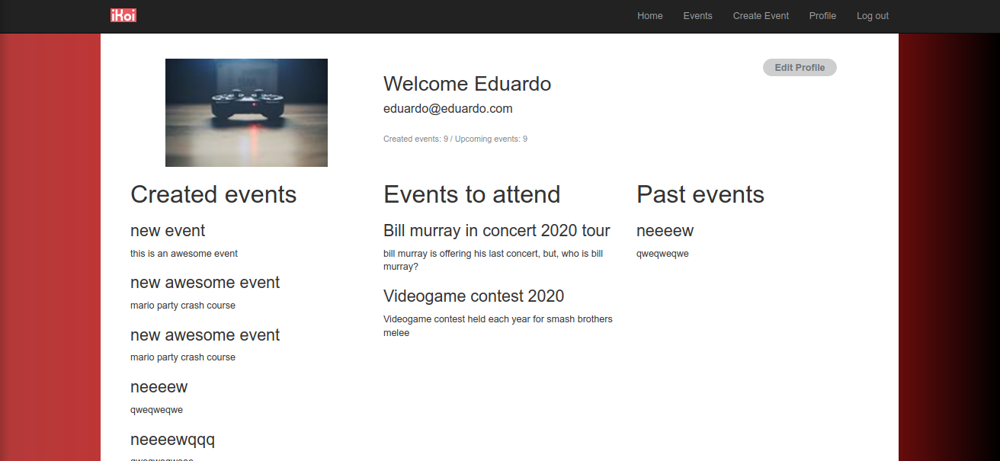
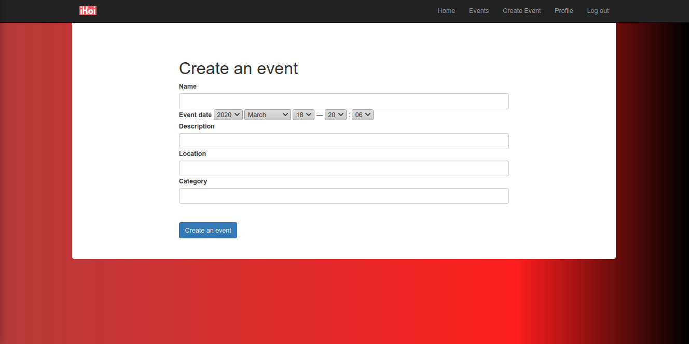
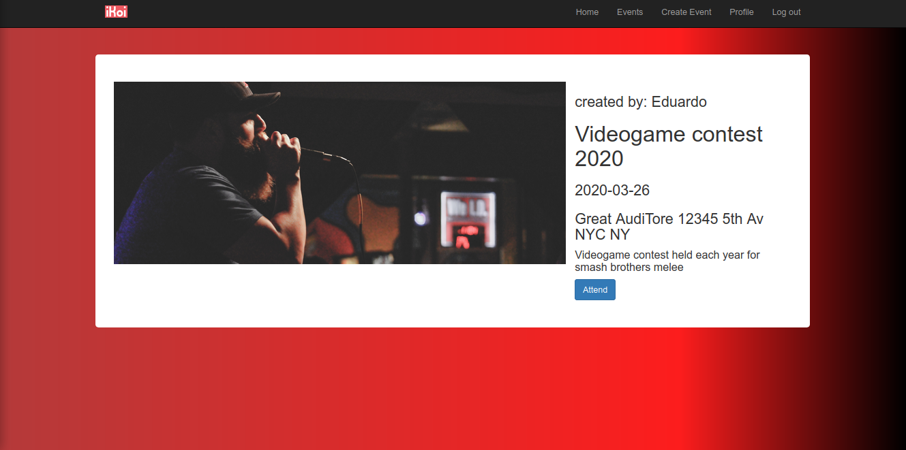

 

  

  <h3 align="center">iKoi: Private Events project on rails</h3>

  

    A Ruby on Rails app for users to create and attend events
     
    <a href="https://www.theodinproject.com/courses/ruby-on-rails/lessons/associations"><strong>Project Specs »</strong></a>
     
     
  

<!-- TABLE OF CONTENTS -->
## Table of Contents

* [About the Project](#about-the-project)
* [How to run](#how-to-run)
* [Features](#features)
* [Screenshots](#screenshots)
* [Testing](#testing)
* [Built With](#built-with)
* [Contact](#contact)

<!-- ABOUT THE PROJECT -->
## About The Project

A Rails app wich allows user to signup,login with secure passwordand view, attend and create events

### How to run
  - After cloning the repository set up the environment by `bundle install --without production`
  - Migrate the database with the `rails db:migrate` command in the terminal
  - Run the server with `rails server`
  - Open your favorite browser and visit your localhost

### Features

* Users can log into the app
* New Users can sign up with secure password
* Not logged in users can see the events at events_path
* Logged users can create new events
* Logged users can attend upcoming events
* User profile shows events to attend and past events
* Logged users already attending an event can cancel the attendance
* User profile shows events created by the user
* Friendly UI lets user logically access this features

### Screenshots
Home
 
Login
 
Signup
 
Events Index
 
User profile
 
Create event
 
Event
 
 
### Testing

* Rspec model testing done for validation and associations
* Rspec controller testing for behaviour
* Rspec - Capybara testing for features

### Built With

Project built in Ruby on Rails
* [Ruby](https://www.ruby-lang.org/en/)
* [Rails](https://rubyonrails.org/)

Additional Gems used
* [Bootstrap-sass](https://github.com/twbs/bootstrap-sass)
* [Bcrypt](https://rubygems.org/gems/bcrypt/versions/3.1.11?locale=es)
* [DatabaseCleaner](https://github.com/DatabaseCleaner/database_cleaner)
* [Shoulda Matchers](https://github.com/thoughtbot/shoulda-matchers)
* [Capybara](https://github.com/teamcapybara/capybara)

## Contact

Eduardo Bonilla [https://github.com/UsagiB](https://github.com/UsagiB)

Leonardo Mezu [https://github.com/leonmezu1](https://github.com/leonmezu1)
